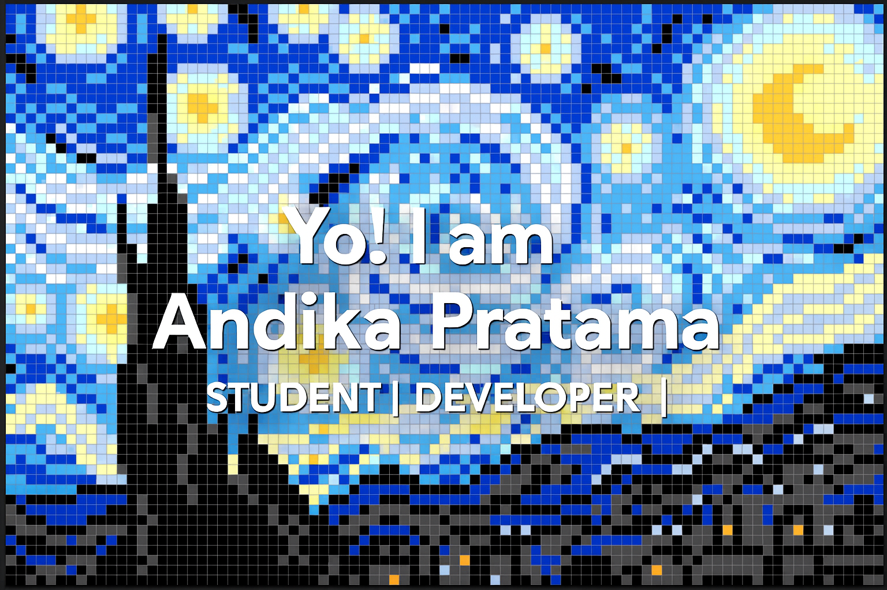

# Hi there! 👋 I'm Andika Pratama

  

## 🕵 Code | Coffee | Create

  

---

## 🛠️ Tech Stack

### Frontend

  
  
  

### Backend

  
  

### Database

  

### Design

  

---

## 📊 GitHub Stats

  

---

## 🌐 Connect With Me

  
  
  

### 🎮 Gaming Profiles

  
  
  

---

## 🐾 Contribution Graph

<picture>
  <source media="(prefers-color-scheme: dark)" srcset="https://raw.githubusercontent.com/anndikapratamma/anndikapratamma/output/pacman-contribution-graph-dark.svg">
  <source media="(prefers-color-scheme: light)" srcset="https://raw.githubusercontent.com/anndikapratamma/anndikapratamma/output/pacman-contribution-graph.svg">
  
</picture>

---

  <i>"Passionate developer who loves turning coffee into code ☕️➡️💻"</i>
  
  

